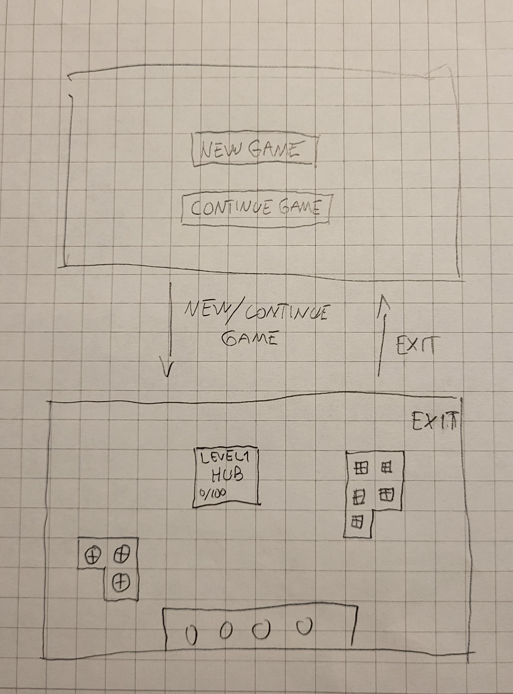

# Software requirements specification

## Brief description

The software in question is a simple factory automation game, where the player is expected to extract and transport various shapes to a central hub. The shape resources are scattered around the central hub on the map. On each level, the hub requests certain shapes and once the shape quota has been reached, the player moves on to the next level.

## UI Sketch

The game consists of two main views.

## Basic functionality

### Menu

- User can start a new game

### Gameplay

- The central hub will display the requested quota of shapes during each level
- Game moves on to next level when quota is reached
- User can extract a shape map tile resource
  - User can equip a share resource extractor
  - User can rotate the equipped building
  - User can place the equipped extractor on a shape resource tile on the map to start extraction
- User can build conveyor belts to transport items
  - User can equip converyor belt
  - User can place the equipped click, hold and drag the mouse on the map to build a conveyor belt path
  - Conveyor belt connected to a resource extractor will start moving items along the belt
- User can destroy built up tiles

## Further development ideas

Here are some other development ideas that might be implemented if time permits:

- Freely allow movement of viewport on map
- Save game progress
- Load levels from files
- Other factory buildings and resources (cutting, painting etc.)
- Allow making selections of built areas, copy and paste
- Allow user to speed game up
- Allow user to pause game
- Beautiful UI
