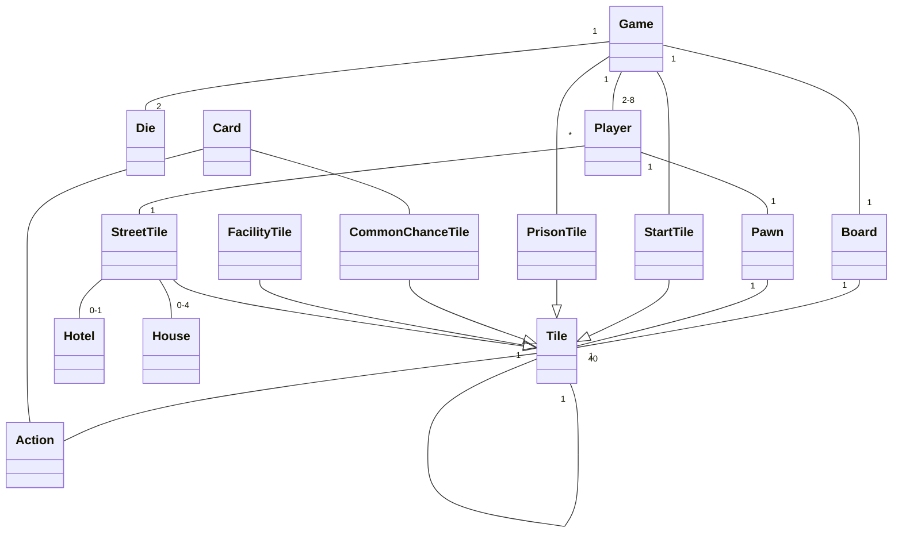

```mermaid
  classDiagram
    Game "1" -- "2" Die
    Game "1" -- "2-8" Player
    Game "1" -- "1" Board
    Board "1" -- "40" Tile
    Tile "1" -- "1" Tile
    Tile -- Action
    Card -- CommonChanceTile
    Card -- Action
    Player "1" -- "1" Pawn
    Pawn "1" -- "1" Tile
    StartTile --|> Tile
    PrisonTile --|> Tile
    CommonChanceTile --|> Tile
    FacilityTile --|> Tile
    StreetTile --|> Tile
    Game -- StartTile
    Game -- PrisonTile
    Player "*" -- "1" StreetTile
    StreetTile -- "0-1" Hotel
    StreetTile -- "0-4" House

    class Action
    class Board
    class Card
    class CommonChanceTile
    class Die
    class FacilityTile
    class Game
    class Hotel
    class House
    class Pawn
    class Player
    class PrisonTile
    class StartTile
    class StreetTile
    class Tile
```