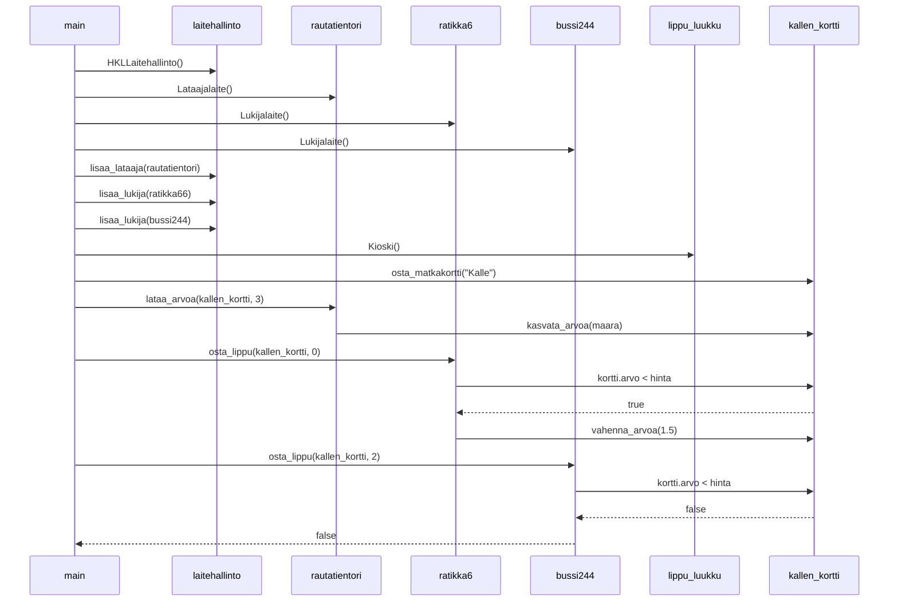

```mermaid
  sequenceDiagram
    participant main
    participant L as laitehallinto
    participant R as rautatientori
    participant R6 as ratikka6
    participant B244 as bussi244
    participant lippu_luukku

    main ->> L: HKLLaitehallinto()
    main ->> R: Lataajalaite()
    main ->> R6: Lukijalaite()
    main ->> B244: Lukijalaite()
    main ->> L: lisaa_lataaja(rautatientori)
    main ->> L: lisaa_lukija(ratikka66)
    main ->> L: lisaa_lukija(bussi244)
    main ->> lippu_luukku: Kioski()
    main ->> kallen_kortti: osta_matkakortti("Kalle")
    main ->> R: lataa_arvoa(kallen_kortti, 3)
    R ->> kallen_kortti: kasvata_arvoa(maara)
    main ->> R6: osta_lippu(kallen_kortti, 0)
    R6 ->> kallen_kortti: kortti.arvo < hinta
    kallen_kortti -->> R6: true
    R6 ->> kallen_kortti: vahenna_arvoa(1.5)
    main ->> B244: osta_lippu(kallen_kortti, 2)
    B244 ->> kallen_kortti: kortti.arvo < hinta
    kallen_kortti -->> B244: false
    B244 -->> main: false

```
